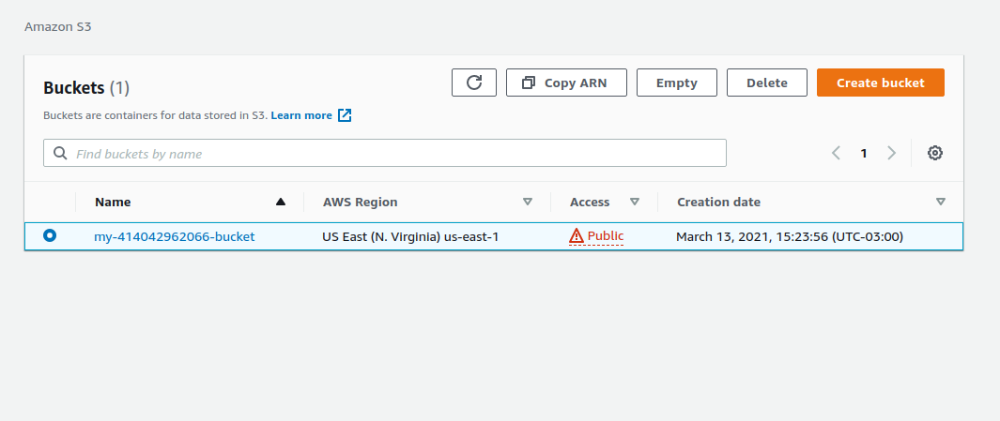
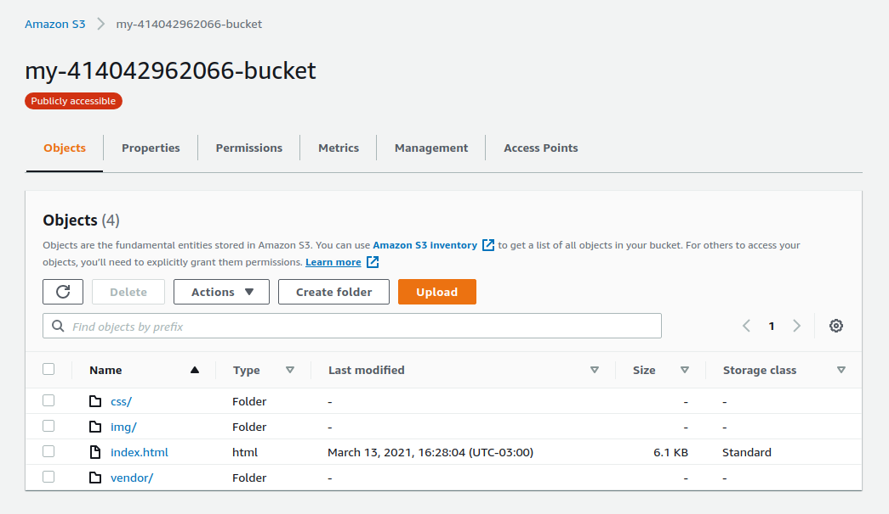
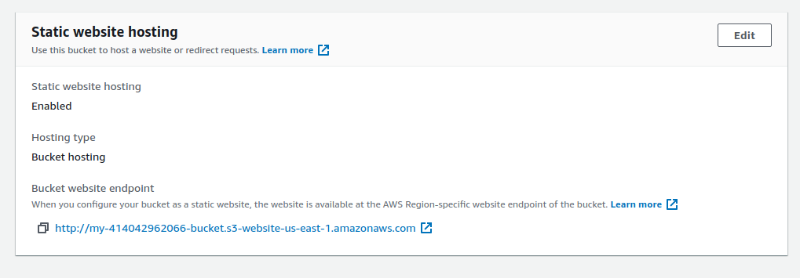
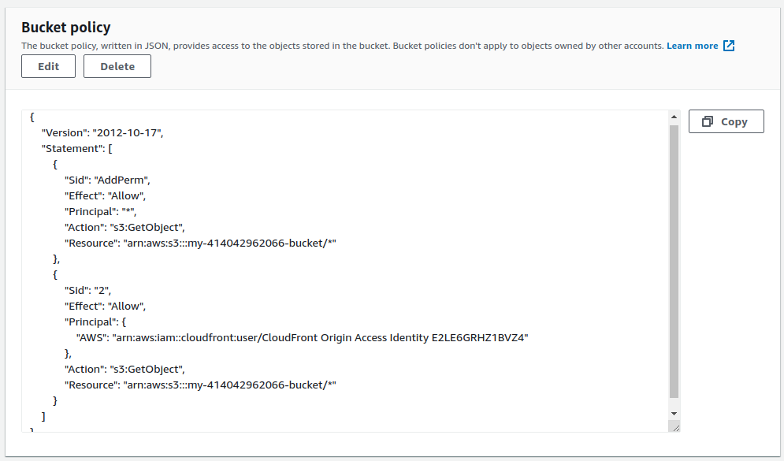
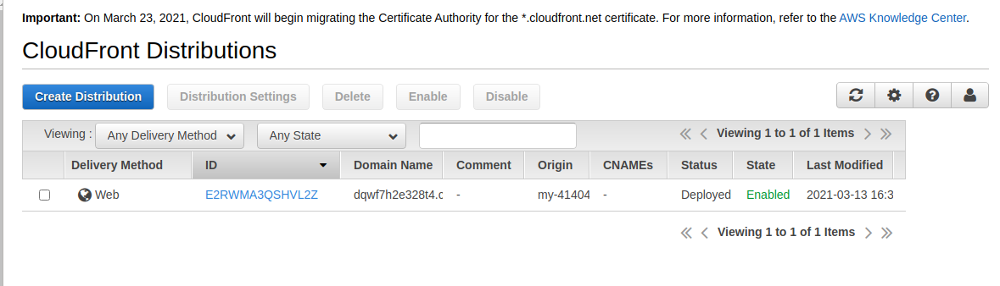
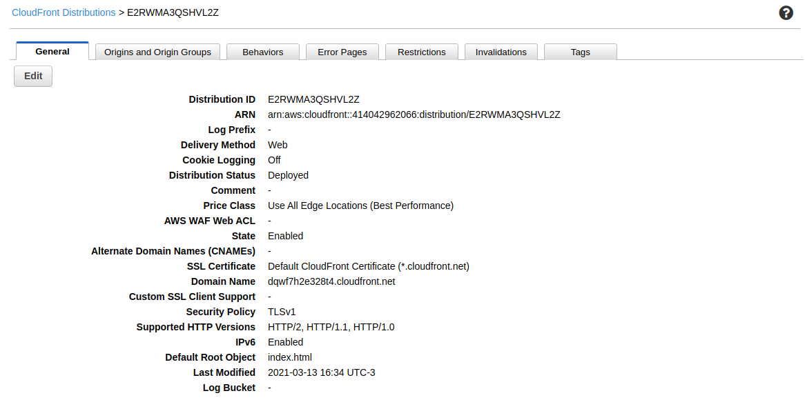
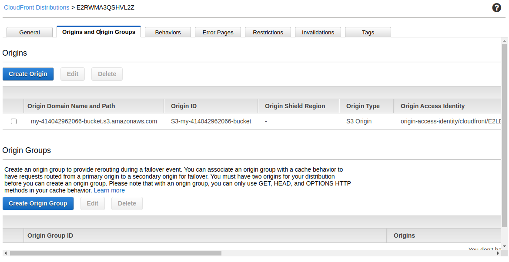
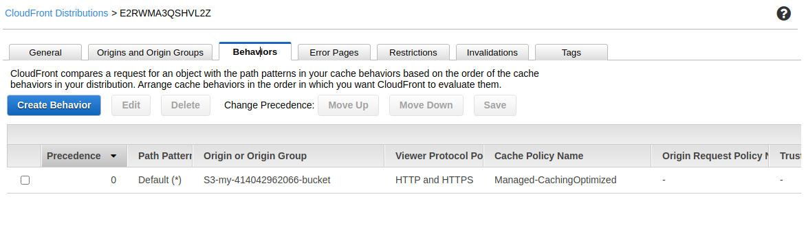

## Udacity - Udacity  Deploy Static Website on AWS

Some screenshots of a step by step to create a static website on AWS using S3 and Cloud Front. This was done during the Udacity Cloud Engineering Nanodegree.

